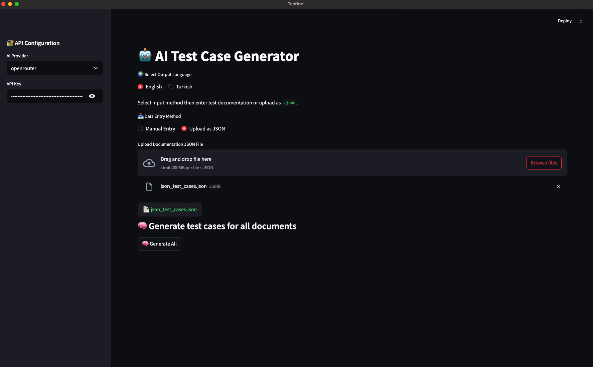

# Testinel - AI Test Case Generator

**Testinel**, OpenAI ve OpenRouter API'lerini kullanarak yazılım test senaryoları üreten bir masaüstü uygulamasıdır.  
Electron.js + Streamlit entegrasyonu sayesinde, kullanıcı dostu bir masaüstü arayüzünde çalışır.  

---

## 🚀 Özellikler
- 🟢 **AI destekli test case üretimi**
- 🔐 API sağlayıcısı seçimi (OpenAI / OpenRouter)
- 🌍 İngilizce ve Türkçe çıktı desteği
- 📥 Manuel giriş / JSON yükleme
- 📦 JSON ve TXT çıktıları indirme
- 💻 MacOS (arm64/x64) ve Windows paketleri

---

## ⚙️ Gereksinimler
- MacOS: Apple Silicon veya Intel işlemcili Mac.
- Windows: Windows 10 ve üzeri.
- İnternet bağlantısı (OpenAI / OpenRouter API çağrısı için).

---

## 📦 Kurulum

### 💻 MacOS (.dmg)
1. İndirmek için işlemci mimarisine uygun dosyayı seç.
 - Apple Silicon (M1, M2, M3 vb.):
[Testinel(MacOS Apple Silicon)](https://github.com/ayberkbaydar/TestCaseAgentApp/releases/download/v1.0.0/Testinel-1.0.0-arm64.dmg)
 - Intel İşlemciler (x64):
[Testinel(MacOS Intel x64)](https://github.com/ayberkbaydar/TestCaseAgentApp/releases/download/v1.0.0/Testinel-1.0.0.dmg)
2. `.dmg`’yi aç → `Testinel` uygulamasını sürükleyerek `Applications` klasörüne taşı.
3. İlk açılışta `Apple Developer` imzası taşımadığı için uyarı verebilir.
    🔧 Çözüm:
        Terminalde `xattr -rd com.apple.quarantine /Applications/Testinel.app` komutunu
        çalıştırarak karantina bayrağını kaldırıp uygulamayı açabilirsin.
4. Keyifle kullan!

### 💻 Windows (.exe)
1. `.exe` dosyasını indir.
[Testinel(Windows x64)](https://github.com/ayberkbaydar/TestCaseAgentApp/releases/download/v1.0.0/Testinel.Setup.1.0.0.exe)
2. Çift tıklayarak yüklemeyi başlat.
3. Yükleme tamamlandığında uygulamayı aç → Keyifle kullan!

---

## 🔑 OpenRouter API Key Alma & Kullanımı

### 📥 OpenRouter API Key Nasıl Alınır?
1. [OpenRouter.ai](https://openrouter.ai/) sitesine git.
2. Hesap oluştur / giriş yap.
3. `API Keys` bölümüne git → `New API Key` oluştur.
4. Oluşturulan anahtarı kopyala (örneğin: `org-abc123...`).

### 🚀 Uygulamada API Key Kullanımı
1. Uygulamayı aç.
2. Sol paneldeki “🔐 API Configuration” kısmında:
   - **AI Provider:** `openrouter` veya `openai` seç.
   - **API Key:** Aldığın API Key’i buraya yapıştır.
3. Uygulamayı test senaryoları oluşturmak için kullan!

💡 **Not:**  
- API Key’ini kimseyle paylaşma.  
- API Key alanı her açılışta boş gelir, her seferinde tekrar girmen gerekir.

---

## 📸 Ekran Görüntüleri

---

## 🌟 Katkı ve Destek
- Her türlü geliştirme / katkı / öneri için lütfen PR açmaktan çekinmeyin!
- İletişim: [LinkedIn profilin](https://linkedin.com/in/ayberkbaydar)  

---

## 🪄 Lisans
[MIT License](./LICENSE) - Ayrıntılı bilgi için `LICENSE` dosyasına göz atabilirsiniz.

---

> ✨ Geliştirici: Ayberk Baydar  
> ✉️ İletişim: ayberkbaydar1995@gmail.com  
> 💼 LinkedIn: [ayberkbaydar](https://linkedin.com/in/ayberkbaydar)

